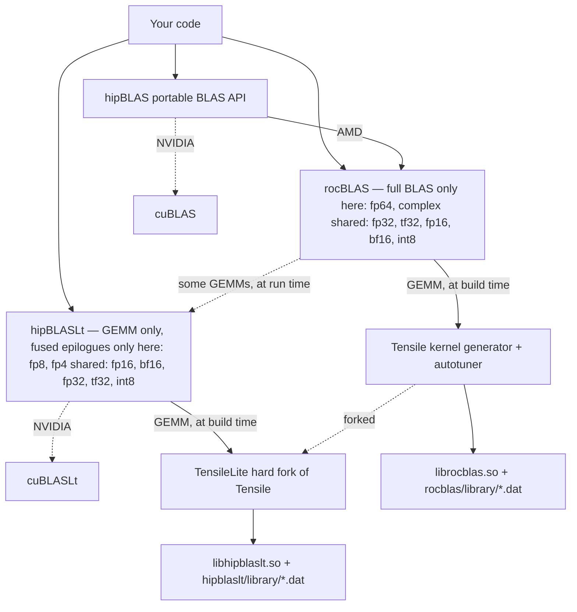

# ROCm GEMM benchmarking container

An Apptainer image that adds the rocBLAS clients — most importantly
`rocblas-bench` — to the stock ROCm development image, plus a script that
sweeps GEMM across precisions and reports the clock and power the GPU actually
settles at rather than its nominal boost clock.

The AMD ROCm packages ship `librocblas.so` but not the benchmark and test
executables, so the clients have to be compiled from source. This image builds
them against the rocBLAS library already present in the base image, pinned to
the exact upstream commit that library was built from, so the two are
ABI-compatible.

## Contents

| File | Purpose |
| --- | --- |
| `apptainer.def` | Container definition: ROCm 7.14 + rocBLAS clients |
| `bench_precisions.sh` | Precision sweep with clock/power sampling |

`*.sif` images and `*.csv` results are gitignored; they are large and
machine-specific.

## Prerequisites

- Apptainer 1.4+ with `--fakeroot` available
- The base image, pulled once:

```bash
apptainer pull base.sif docker://rocm/dev-ubuntu-24.04:7.14.0-full
```

`apptainer.def` bootstraps from that local `base.sif` so repeated builds do not
re-download ~8 GB. To make the definition self-contained instead, swap the
`BootStrap`/`From` lines for the `docker://` variant commented at the top of
the file.

## Build

```bash
apptainer build --fakeroot rocblas.sif apptainer.def
```

Takes about 3.5 minutes on a 188-core host and produces a ~7.6 GB image. Only
the clients are compiled; the rocBLAS library itself is not rebuilt, which is
what keeps the build short. `rocblas-test` is off by default because it adds
hours — set `BUILD_TESTS=ON` in `%post` if you need it.

Device code is generated for `gfx908`, `gfx90a`, `gfx942` and `gfx950`, i.e.
MI100, MI200, MI300X and MI350X.

## Running

The image carries a complete ROCm stack, so `--rocm` is unnecessary and only
causes host libraries to shadow the container's:

```bash
apptainer exec rocblas.sif rocblas-bench --version
```

On HPCFund-TW the login node has an MI100. Use Slurm to reach the datacenter
parts — `mi3001x` for a single MI300X, `mi3501x` for a single MI350X:

```bash
srun -N1 -n1 -p mi3001x --gres=gpu:1 -t 00:15:00 \
  apptainer exec rocblas.sif \
  rocblas-bench -f gemm -r f64_r \
    --transposeA T --transposeB N -m 8192 -n 8192 -k 8192 \
    --alpha 1 --beta 0 -i 300 -j 20
```

`-r` selects the precision (`f64_r`, `f32_r`, `f16_r`, `bf16_r`, `i8_r`, and
the complex variants). `-i` is the number of timed iterations and `-j` the
warm-up iterations before timing starts; the defaults of 10 and 2 are too few
to reach a steady state. Add `-v 1` to norm-check the result against CPU BLAS,
but only at small sizes — it is very slow.

`apptainer run` is wired to `rocblas-bench`, so the `exec rocblas.sif
rocblas-bench` prefix can be shortened to `run rocblas.sif`.

## Precision sweep

`bench_precisions.sh` runs a sustained GEMM per precision while sampling clock
and power, then prints a summary table:

```bash
srun -N1 -n1 -p mi3501x --gres=gpu:1 -t 00:40:00 \
  apptainer exec --bind "$PWD":/work rocblas.sif \
  bash /work/bench_precisions.sh -o /work/mi350x.csv
```

| Option | Meaning |
| --- | --- |
| `-s SIZE` | Square GEMM dimension (default 16384) |
| `-t SECONDS` | Target duration per precision (default 25) |
| `-p LIST` | Comma-separated subset, e.g. `-p f64_r,f16_r` |
| `-o FILE` | Also write results as CSV |

Iteration counts are calibrated per precision from a short trial run, so every
measurement covers the same wall-clock duration regardless of how fast the
precision is. A sample counts toward the steady state only once power exceeds
1.5x idle, and the first qualifying sample is discarded because power reaches
the cap before clocks finish settling. A precision the GPU does not support
produces no samples at all and is reported as `unsupported`.

## How the libraries relate



**hipBLAS is not an implementation.** It is a marshalling layer that exposes the
classic netlib BLAS surface and forwards each call to rocBLAS on AMD or cuBLAS
on NVIDIA. No kernel of its own ever reaches the GPU, so it shows up in a
performance discussion only as dispatch overhead.

**rocBLAS implements everything except GEMM itself.** Levels 1 and 2 are
hand-written HIP in the library. GEMM is far too sensitive to shape and
architecture for that, so those kernels come from Tensile — a Python generator
and autotuner that emits CDNA assembly at build time along with per-architecture
logic files that pick a solution at run time from the problem dimensions.
Generating and compiling that kernel set is why a full rocBLAS build takes
hours, and why this image compiles only the clients and reuses the prebuilt
`librocblas.so`.

**hipBLASLt is the counterpart of cuBLASLt.** GEMM only, but it exposes what the
classic interface cannot express: fused epilogues (bias, activation, scaling),
narrow types such as FP8, and explicit algorithm enumeration behind a reusable
plan. Its kernels come from TensileLite, a hard fork of Tensile that lives
inside the hipBLASLt tree under `tensilelite/`. The two generators share an
ancestry and a vocabulary but have diverged; a kernel tuned in one does not
exist in the other.

**The dashed rocBLAS → hipBLASLt edge is real at run time.** Recent rocBLAS
carries both backends and chooses per problem and architecture, falling back to
Tensile whenever hipBLASLt has no solution. `ROCBLAS_USE_HIPBLASLT=0` pins
Tensile and `=1` prefers hipBLASLt, which is worth knowing when a
`rocblas-bench` number is surprising and you want to establish which backend
produced it.

All of these now live in the `ROCm/rocm-libraries` monorepo — `projects/rocblas`,
`projects/hipblas`, `projects/hipblaslt` and `shared/tensile`, with TensileLite
under `projects/hipblaslt/tensilelite`. The standalone repositories are
deprecated, which is why `apptainer.def` sparse-checks-out the monorepo rather
than cloning rocBLAS directly.

### Which data type lives where

| Data type | rocBLAS / Tensile | hipBLASLt / TensileLite | In the sweep |
| --- | --- | --- | --- |
| `f64_r`, `f32_c`, `f64_c` | yes | no | `f64_r` only |
| `f32_r` | yes | yes | yes |
| TF32 compute on FP32 data | `--math_mode 1`, gfx942 only | `HIPBLAS_COMPUTE_32F_FAST_TF32`, native on gfx942, emulated on gfx950 | yes |
| `f16_r`, `bf16_r` | yes | yes, and where new tuning lands | yes |
| `i8_r` → `i32_r` | yes | yes | yes |
| FP8 `e4m3` / `e5m2` | no | yes — `fnuz` on gfx942, OCP on gfx950 | no |
| FP4 `e2m1` | no | input only, gfx950 | no |

The two ends of that table are exclusive, and that is the cleanest way to
remember the split. FP64 and complex belong to rocBLAS alone — the HPL and
scientific-computing side, which TensileLite never targeted. FP8 and FP4 belong
to hipBLASLt alone; rocBLAS's documented type list stops at int8. (hipBLASLt's
`hipDataType` enum does expose complex types and a `HIPBLAS_COMPUTE_64F` mode,
but its ROCm 7.14 support overview lists only int8, fp8, fp4, fp16, bf16 and
fp32, so treat FP64 and complex as rocBLAS territory in practice.)

The middle rows are where the choice actually matters, and the catch is that it
may not be yours to make: `f16_r` and `bf16_r` exist in both, hipBLASLt is
usually where the newer kernels and tuning land, and rocBLAS's auto-selection
may already be routing those calls to hipBLASLt. The FP16 and BF16 numbers in
`mi300x.csv` and `mi350x.csv` were collected without pinning a backend, so some
of them are plausibly hipBLASLt kernels measured through the rocBLAS API. To
find out, run the sweep twice — if the two agree, Tensile served both:

```bash
ROCBLAS_USE_HIPBLASLT=0 bash /work/bench_precisions.sh -p f16_r,bf16_r -o /work/tensile.csv
ROCBLAS_USE_HIPBLASLT=1 bash /work/bench_precisions.sh -p f16_r,bf16_r -o /work/hipblaslt.csv
```

## Notes

**Host environment leaks into the container.** A `module load rocm` on the host
exports `HIP_PATH=/opt/rocm-7.2.0`, `CPATH` and friends. That path does not
exist inside the image, so `amdclang` fails with `cannot find HIP runtime` on
every HIP source file. `%post` unsets these before building and `%environment`
re-asserts `ROCM_PATH`/`HIP_PATH` so the runtime is protected too. If you hit
something similar with another container, `--cleanenv` is the quick diagnostic.

**FP8 is not covered.** `rocblas-bench` in this version supports precisions only
up to `i8_r`; FP8 GEMM goes through hipBLASLt, and the base image ships
`libhipblaslt.so` without `hipblaslt-bench`. Building the hipBLASLt clients the
same way rocBLAS's are built — `projects/hipblaslt` in the same monorepo
checkout — would add it.

**TF32 is MI300X-only through this path.** The `--math_mode 1` path returns no
result on gfx950 and leaves the GPU idle, consistent with the MI350X datasheet
not listing a TF32 rate while the MI300X one specifies 653.7 TFLOPS. The
capability is not absent from the part, though: hipBLASLt documents
`HIPBLAS_COMPUTE_32F_FAST_TF32` as native on gfx942 and *emulated* on gfx950, so
a TF32 number for MI350X would have to come from `hipblaslt-bench` and would be
measuring emulation rather than hardware.

**Larger is not always faster.** Both parts lose throughput going from 8192³ to
16384³ (MI300X 79.3 → 64.0 TFLOPS in FP64), so quote the size alongside any
number.

**rocblas-bench is single-GPU.** To load a whole node, request
`-p mi3008x --gres=gpu:8 --exclusive` and launch one process per GPU with
`--device 0` through `--device 7`.
