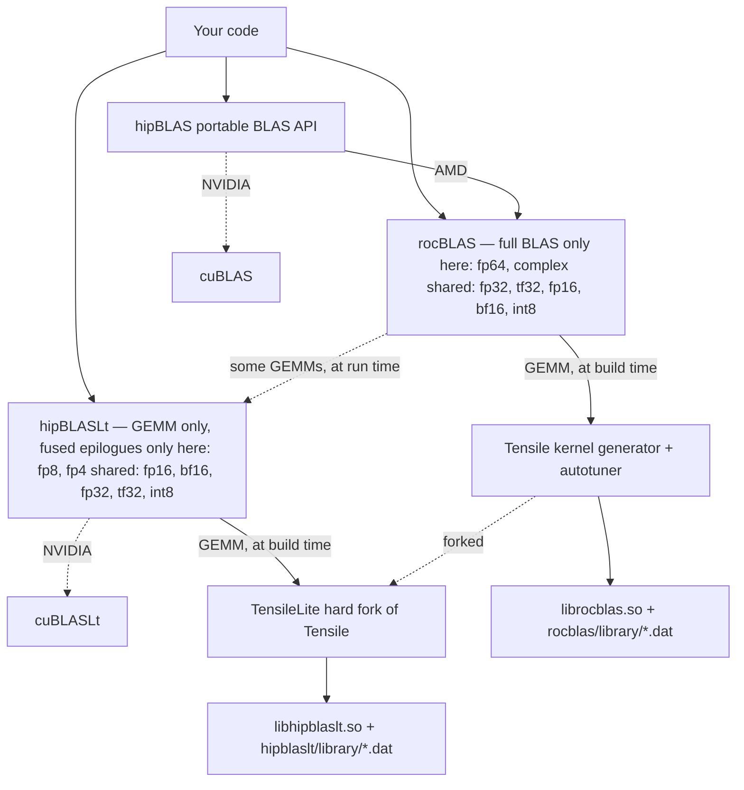

# ROCm GEMM benchmarking sweep

An Apptainer image that adds the rocBLAS and hipBLASLt clients —
`rocblas-bench` and `hipblaslt-bench` — to the stock ROCm development image,
plus a script that sweeps GEMM across precisions and reports the clock and
power the GPU actually settles at rather than its nominal boost clock.

The AMD ROCm packages ship `librocblas.so` and `libhipblaslt.so` but not the
benchmark and test executables, so the clients have to be compiled from source.
This image builds them against the libraries already present in the base image,
pinned to the exact upstream commit those libraries were built from, so the two
are ABI-compatible.

## Contents

| File | Purpose |
| --- | --- |
| `apptainer.def` | Container definition: ROCm 7.14 + rocBLAS and hipBLASLt clients |
| `bench_precisions.py` | Precision sweep with clock/power sampling |
| `bench_config.json` | Which precisions and backends each chip runs |
| `machine_peaks.json` | Ceilings measured on this machine, for the roofline columns |
| `bench_precisions.sh` | The original single-backend sweep, kept for reference |

`*.sif` images and `*.csv` results are gitignored; they are large and
machine-specific.

## Prerequisites

- Apptainer 1.4+ with `--fakeroot` available

## Build

```bash
apptainer build --fakeroot rocblas.sif apptainer.def
```

Takes about 11 minutes on a 188-core host and produces a ~7.7 GB image. Only
the clients are compiled — neither library is rebuilt, and hipBLASLt is built
with `-n` so its Tensile kernels are not regenerated either. That is what keeps
the build short. `rocblas-test` is off by default because it adds hours; set
`BUILD_TESTS=ON` in `%post` if you need it. `hipblaslt-test` is cheap and is
always built.

rocBLAS device code is generated for `gfx908`, `gfx90a`, `gfx942` and `gfx950`
(MI100, MI200, MI300X, MI350X). hipBLASLt only supports CDNA2 and newer, so its
clients are built for `gfx942` and `gfx950` only.

## Running

The image carries a complete ROCm stack, so `--rocm` is unnecessary and only
causes host libraries to shadow the container's:

```bash
apptainer exec rocblas.sif rocblas-bench --version
```

On HPCFund-TW the login node has an MI100, so every real measurement has to go
through Slurm: `-p mi3001x` for a single MI300X, `-p mi3501x` for a single
MI350X. Every example below takes that form.

## Precision sweep

`bench_precisions.py` runs a sustained GEMM per precision while sampling clock
and power, then prints a summary table. Where a data type exists in both
libraries it is measured on both, one row each, so the two are directly
comparable:

```bash
srun -N1 -n1 -p mi3501x --gres=gpu:1 -t 00:40:00 \
  apptainer exec --bind "$PWD":/work rocblas.sif \
  python3 /work/bench_precisions.py -o /work/mi350x.csv
```

Only the standard library is used, so the container's own `python3` is enough,
and `bench_config.json` is read from beside the script, so binding the
repository in is all the setup there is. The recorded MI300X sweep in
`mi300x.csv` renders like this — it predates the two-backend rows, so each type
appears once:

```
┌───────────┬──────────────┬───────────────┬──────────────┬─────────────┬────────┐
│ Precision │ BLAS backend │    Throughput │ Steady Clock │ % Max Clock │  Power │
├───────────┼──────────────┼───────────────┼──────────────┼─────────────┼────────┤
│ f64_r     │ rocBLAS      │   55.4 TFLOPS │     1795 MHz │         82% │  983 W │
│ f32_r     │ rocBLAS      │  115.7 TFLOPS │     1826 MHz │         83% │  988 W │
│ f32_r     │ hipBLASLt    │  130.7 TFLOPS │     2095 MHz │         95% │  969 W │
│ tf32      │ hipBLASLt    │  392.9 TFLOPS │     1318 MHz │         60% │ 1000 W │
│ f16_r     │ rocBLAS      │ 1082.5 TFLOPS │     1129 MHz │         51% │ 1000 W │
│ f16_r     │ hipBLASLt    │ 1081.0 TFLOPS │     1126 MHz │         51% │ 1000 W │
│ bf16_r    │ rocBLAS      │ 1149.1 TFLOPS │     1256 MHz │         57% │ 1000 W │
│ bf16_r    │ hipBLASLt    │ 1146.0 TFLOPS │     1252 MHz │         57% │ 1000 W │
│ i8_r      │ rocBLAS      │   3087.7 TOPS │     2159 MHz │         98% │  970 W │
│ i8_r      │ hipBLASLt    │   2304.1 TOPS │     1465 MHz │         67% │ 1000 W │
│ f8_r      │ hipBLASLt    │ 2100.3 TFLOPS │     1501 MHz │         68% │  999 W │
└───────────┴──────────────┴───────────────┴──────────────┴─────────────┴────────┘
```

Progress goes to stderr and the table to stdout, so redirecting stdout leaves
only the results. Under a C locale the box characters fall back to ASCII.

| Option | Meaning |
| --- | --- |
| `-s SIZE` | Square GEMM dimension (default 16384) |
| `-t SECONDS` | Target duration per case (default 25) |
| `-p LIST` | Comma-separated precision subset, e.g. `-p f64_r,f16_r` |
| `-b LIST` | Comma-separated backend subset, e.g. `-b hipblaslt` |
| `-d N` | Which of the visible GPUs to use (default 0) |
| `-o FILE` | Also write results as CSV |
| `-f FORMAT` | Stdout format: `table`, `markdown` or `csv` |
| `-c FILE` | Configuration file (default `bench_config.json` beside the script) |
| `--chip NAME` | Use a named chip profile instead of the detected one |
| `--peaks FILE` | Measured ceilings (default `machine_peaks.json` beside the script) |
| `--calibrate-peaks` | Measure this GPU's ceilings, write them to the peaks file, and exit |
| `--list-chips` | Print the profiles in the config and exit |

Iteration counts are calibrated per case from a short trial run, so every
measurement covers the same wall-clock duration regardless of how fast the
precision is. A sample counts toward the steady state only once power exceeds
1.5x idle, and the first qualifying sample is discarded because power reaches
the cap before clocks finish settling. A combination the GPU or library does not
support produces no result at all and is reported as `unsupported` rather than
aborting the sweep.

Clock and power come from `amd-smi`, which has to be pointed at the one GPU
doing the work: on a multi-GPU node it numbers GPUs by PCI address while the
ROCm runtime numbers them by KFD node id, and those orders do not agree, so an
index carried across from one to the other lands on an idle neighbour and every
reading comes back blank. The script instead pins the benchmarks to the device
given by `-d` and finds it in `amd-smi` by matching the PCI address `rocminfo`
reports for it, which needs nothing from the scheduler and so behaves the same
under Slurm as on a bare node. The header line prints the resolved address and
index; verify it there if the numbers ever look wrong.

### Roofline

A throughput number on its own does not say whether the GPU was working hard
or barely trying. Two extra columns answer that, and both need a one-off
calibration step:

```bash
srun -N1 -n1 -p mi3501x --gres=gpu:1 -t 00:20:00 \
  apptainer exec --bind "$PWD":/work rocblas.sif \
  python3 /work/bench_precisions.py --calibrate-peaks
```

That runs `rocprof-compute profile --bench-only`, which executes the ROCm
Compute Profiler's roofline microbenchmarks and nothing else — no application,
no hardware counters — and records what it measures in `machine_peaks.json`:
HBM, MALL, L2, L1 and LDS bandwidth, plus a peak for every MFMA data type the
part has, down to FP4 and FP6 on gfx950. Every later sweep reads that file, so
the cost is paid once per machine rather than once per run.

Avoiding counters is the point. Counter collection is often locked down on a
shared cluster, and it perturbs exactly what this script exists to measure —
clocks and power under a sustained load — so it can never be part of the sweep
itself. Note also that the microbenchmark drives back-to-back MFMA with no
memory traffic, which holds a higher clock than any real GEMM sustains: the
result is an absolute ceiling, not a fair target.

With a peaks file present the table gains `% Peak` and `Efficiency`:

```
┌───────────┬──────────────┬───────────────┬────────┬──────────────┬─────────────┬────────┬───────────────┐
│ Precision │ BLAS backend │    Throughput │ % Peak │ Steady Clock │ % Max Clock │  Power │    Efficiency │
├───────────┼──────────────┼───────────────┼────────┼──────────────┼─────────────┼────────┼───────────────┤
│ f16_r     │ hipBLASLt    │ 1418.2 TFLOPS │  67.5% │     1583 MHz │         66% │ 1400 W │ 1.01 TFLOPS/W │
│ bf16_r    │ hipBLASLt    │ 1516.6 TFLOPS │  72.2% │     1768 MHz │         74% │ 1400 W │ 1.08 TFLOPS/W │
│ i8_r      │ rocBLAS      │   3324.1 TOPS │  83.1% │     2398 MHz │        100% │ 1069 W │   3.11 TOPS/W │
└───────────┴──────────────┴───────────────┴────────┴──────────────┴─────────────┴────────┴───────────────┘
```

Read `% Peak` next to `% Max Clock`. FP16 reaching 67% of peak while sitting at
66% of max clock says the kernel is close to the best the part can do *at the
clock it was allowed to hold*, and that the gap to the headline number is a
power limit rather than a software problem. INT8 at 83% while holding full
clock is a different situation entirely.

The CSV carries more than the table does: `arith_intensity`, `bound`,
`attainable` and `pct_roofline` place each measurement on the roofline proper.
GEMM's arithmetic intensity is analytic — \(2mnk\) FLOP over
\((mk + kn)\) operand bytes plus \(mn\) result bytes, with `beta` at 0 so C is
never read — so no profiling is needed to know where a shape sits. A 16384³
FP16 GEMM lands at 5461 FLOP/byte, far into the compute-bound region, and
`pct_roofline` equals `% Peak` there. A decode-shaped GEMM with `m=16` lands at
16 FLOP/byte instead, where the bandwidth ceiling binds: 0.5% of peak but 11%
of what the shape actually permits. The script prints a note on stderr whenever
a case falls on the memory side so the two are not confused.

Two things are deliberately blank rather than guessed. TF32 has no `% Peak`
because the microbenchmark measures no TF32 ceiling and gfx950 emulates TF32
rather than running it on the MFMA units, so the FP32 ceiling would be the
wrong denominator. A peaks file recorded on a different GPU is refused with a
warning instead of being used, since a wrong denominator is worse than no
percentage. Without any peaks file the sweep behaves exactly as it did before
and the two columns do not appear.

### Configuration

Which precisions run, and on which backends, is decided entirely by
`bench_config.json`; adding a data type or a chip needs no change to the script.

| Section | Contents |
| --- | --- |
| `defaults` | Matrix size, target seconds per case, sampling interval, iteration floors, output format |
| `roofline` | The profiler binary, where the measured ceilings live, and which bandwidth ceiling to use |
| `backends` | Per-library binary name, the common arguments, and which CSV columns carry throughput and time |
| `precisions` | Per data type: the unit (`TFLOPS` or `TOPS`), the ceiling it is measured against, its operand widths, and one argument template per backend |
| `chips` | Per architecture: the strings that identify it, and an ordered map of precision to backend list |

A precision's `peak` names a column of `roofline.csv` — `MFMAF16Flops`,
`MFMAI8Ops` and so on — and its `bytes` gives the width of an A/B element and
of a C/D element. Both are what make the roofline columns come out right for a
mixed-width type such as `i8_r`, whose operands are one byte but whose output
is four. Setting `peak` to `null` opts a type out of the percentage entirely,
which is what TF32 does and why.

## Driving the clients directly

The sweep covers the cases worth tracking over time. A one-off question — an
unusual shape, a fused epilogue, a norm check — is quicker to ask of the
clients themselves, and the flags below are the ones the sweep builds its own
command lines from.

### rocblas-bench

```bash
srun -N1 -n1 -p mi3001x --gres=gpu:1 -t 00:15:00 \
  apptainer exec rocblas.sif \
  rocblas-bench -f gemm -r f64_r \
    --transposeA T --transposeB N -m 8192 -n 8192 -k 8192 \
    --alpha 1 --beta 0 -i 300 -j 20
```

`-r` selects the precision (`f64_r`, `f32_r`, `f16_r`, `bf16_r`, `i8_r`, and
the complex variants). `-i` is the number of timed iterations and `-j` the
warm-up iterations before timing starts; the defaults of 10 and 2 are too few
to reach a steady state. Add `-v 1` to norm-check the result against CPU BLAS,
but only at small sizes — it is very slow.

`apptainer run` is wired to `rocblas-bench`, so the `exec rocblas.sif
rocblas-bench` prefix can be shortened to `run rocblas.sif`.

### hipblaslt-bench

`rocblas-bench` has no FP8 type, so FP8 has to go through hipBLASLt. Note the
different flag spellings — `--transA`/`--transB` rather than
`--transposeA`/`--transposeB`:

```bash
srun -N1 -n1 -p mi3001x --gres=gpu:1 -t 00:15:00 \
  apptainer exec rocblas.sif \
  hipblaslt-bench --transA T --transB N -m 8192 -n 8192 -k 8192 \
    --a_type f8_r --b_type f8_r --c_type f16_r --d_type f16_r \
    --compute_type f32_r -i 50 -j 10
```

Use `--a_type`/`--b_type` for FP8, not `--compute_input_typeA`/`B`. The latter
keeps the operands in f16 and downconverts every iteration, which measures the
conversion rather than the GEMM — about 30 TFLOPS instead of 1200 on MI300X.

`f8_r` is the portable spelling: hipBLASLt maps it to the `f8_fnuz_r` format on
gfx942 and to OCP FP8 on gfx950. Asking for `f8_r` through
`--compute_input_type` on gfx942 instead fails with `NO solution found`.

hipBLASLt and rocBLAS results are not directly comparable even at the same
precision — hipBLASLt reaches roughly 1.5x rocBLAS on f16 — which is why the
sweep labels every row with the library that produced it.

## How the libraries relate



**hipBLAS is not an implementation.** It is a marshalling layer that exposes the
classic netlib BLAS surface and forwards each call to rocBLAS on AMD or cuBLAS
on NVIDIA. No kernel of its own ever reaches the GPU, so it shows up in a
performance discussion only as dispatch overhead.

**rocBLAS implements everything except GEMM itself.** Levels 1 and 2 are
hand-written HIP in the library. GEMM is far too sensitive to shape and
architecture for that, so those kernels come from Tensile — a Python generator
and autotuner that emits CDNA assembly at build time along with per-architecture
logic files that pick a solution at run time from the problem dimensions.
Generating and compiling that kernel set is why a full rocBLAS build takes
hours, and why this image compiles only the clients and reuses the prebuilt
`librocblas.so`.

**hipBLASLt is the counterpart of cuBLASLt.** GEMM only, but it exposes what the
classic interface cannot express: fused epilogues (bias, activation, scaling),
narrow types such as FP8, and explicit algorithm enumeration behind a reusable
plan. Its kernels come from TensileLite, a hard fork of Tensile that lives
inside the hipBLASLt tree under `tensilelite/`. The two generators share an
ancestry and a vocabulary but have diverged; a kernel tuned in one does not
exist in the other.

**The dashed rocBLAS → hipBLASLt edge is real at run time.** Recent rocBLAS
carries both backends and chooses per problem and architecture, falling back to
Tensile whenever hipBLASLt has no solution. `ROCBLAS_USE_HIPBLASLT=0` pins
Tensile and `=1` prefers hipBLASLt, which is worth knowing when a
`rocblas-bench` number is surprising and you want to establish which backend
produced it.

All of these now live in the `ROCm/rocm-libraries` monorepo — `projects/rocblas`,
`projects/hipblas`, `projects/hipblaslt` and `shared/tensile`, with TensileLite
under `projects/hipblaslt/tensilelite`. The standalone repositories are
deprecated, which is why `apptainer.def` sparse-checks-out the monorepo rather
than cloning rocBLAS directly.

### Which data type lives where

| Data type | rocBLAS / Tensile | hipBLASLt / TensileLite | In the sweep |
| --- | --- | --- | --- |
| `f64_r`, `f32_c`, `f64_c` | yes | no | `f64_r` only |
| `f32_r` | yes | yes | yes |
| TF32 compute on FP32 data | `--math_mode 1`, gfx942 only | `HIPBLAS_COMPUTE_32F_FAST_TF32`, native on gfx942, emulated on gfx950 | yes |
| `f16_r`, `bf16_r` | yes | yes, and where new tuning lands | yes |
| `i8_r` → `i32_r` | yes | yes | yes |
| FP8 `e4m3` / `e5m2` | no | yes — `fnuz` on gfx942, OCP on gfx950 | yes, via `hipblaslt-bench` |
| FP4 `e2m1` | no | input only, gfx950 | no |

The two ends of that table are exclusive, and that is the cleanest way to
remember the split. FP64 and complex belong to rocBLAS alone — the HPL and
scientific-computing side, which TensileLite never targeted. FP8 and FP4 belong
to hipBLASLt alone; rocBLAS's documented type list stops at int8. (hipBLASLt's
`hipDataType` enum does expose complex types and a `HIPBLAS_COMPUTE_64F` mode,
but its ROCm 7.14 support overview lists only int8, fp8, fp4, fp16, bf16 and
fp32, so treat FP64 and complex as rocBLAS territory in practice.)

The middle rows are where the choice actually matters, and the catch is that it
may not be yours to make: `f16_r` and `bf16_r` exist in both, hipBLASLt is
usually where the newer kernels and tuning land, and rocBLAS's auto-selection
may already be routing those calls to hipBLASLt. The FP16 and BF16 numbers in
`mi300x.csv` and `mi350x.csv` were collected without pinning a backend, so some
of them are plausibly hipBLASLt kernels measured through the rocBLAS API. The
sweep now benchmarks both libraries directly, which shows the gap but not which
kernel served the rocBLAS row; to settle that, pin the backend and compare — if
the two agree, Tensile served both:

```bash
ROCBLAS_USE_HIPBLASLT=0 python3 /work/bench_precisions.py -b rocblas -p f16_r,bf16_r -o /work/tensile.csv
ROCBLAS_USE_HIPBLASLT=1 python3 /work/bench_precisions.py -b rocblas -p f16_r,bf16_r -o /work/hipblaslt.csv
```
